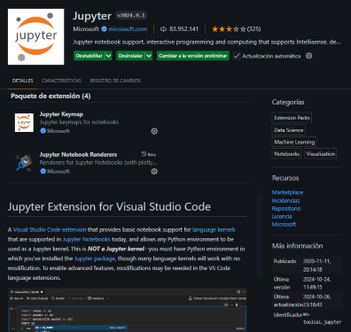
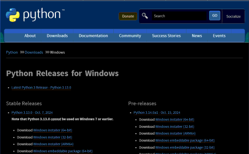
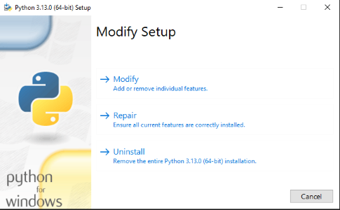
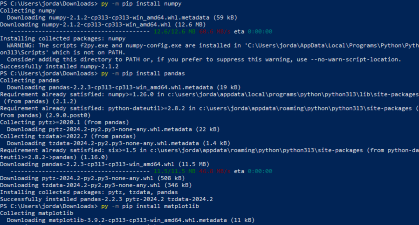
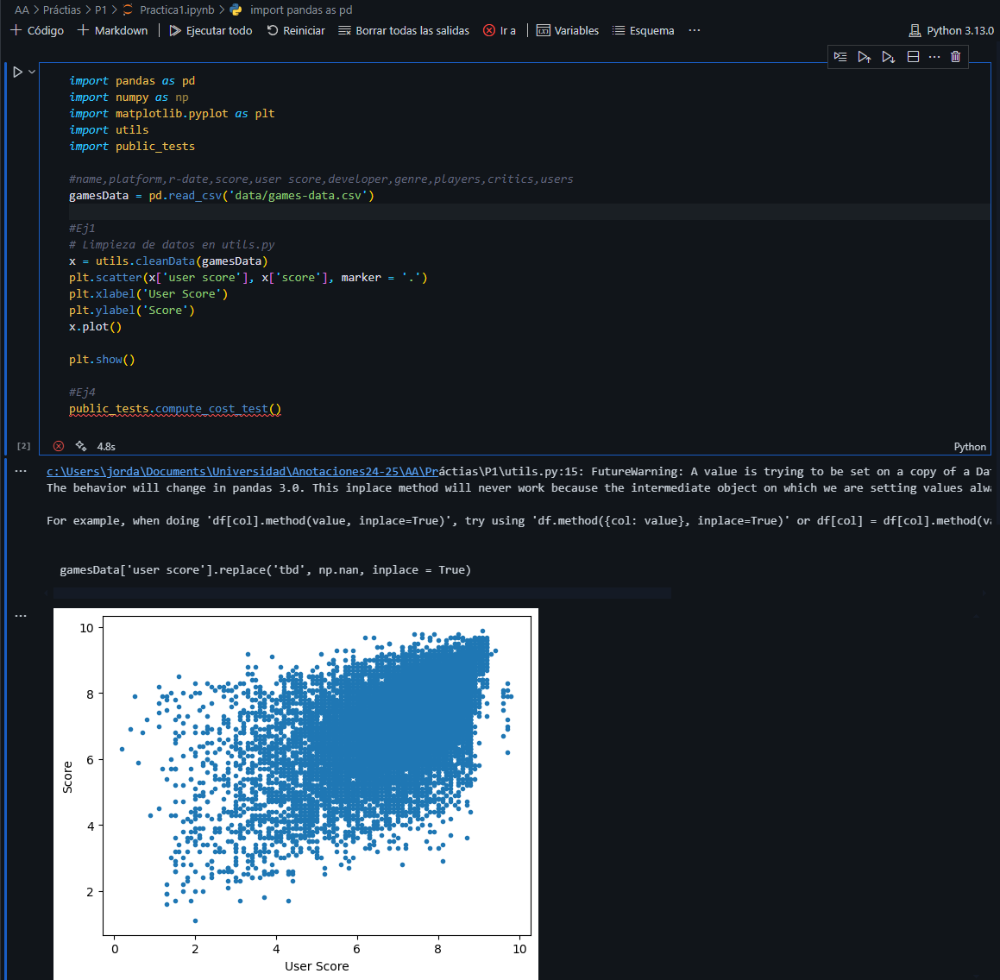

# Setup

Descarga la extension de Notebook en vscode

Instala Python. Asegurate de correrlo en modo administrador.

Abre una consola de PowerShell e instala las dependencias que se necesites como numpy, pandas o matplotlib.

>py -m pip install numpy

>py -m pip install pandas

El editor te permite correr los cuadernos de jupyer usando el kernel de python (Seleccionar arriba a la derecha). Se puede incluir los scpits de manera normal con los imports, crear bloques de comentario y correr en selectivo y en cadena a gusto.

