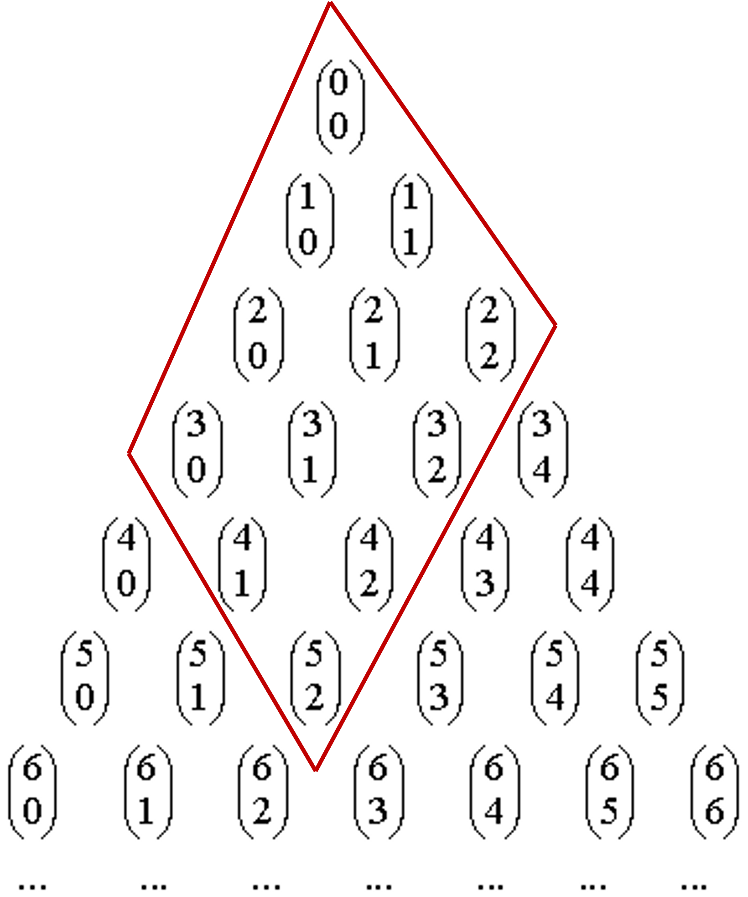

# Semana 10: Programación dinámica (I)

Objetivos:
>Conocer el método algorítmico de la programación dinámica y saber aplicarlo en la resolución de problemas.

>Saber identificar las condiciones bajo las cuales la programación dinámica es ventajosa y aquellas que han de cumplirse para poder aplicarla en los problemas de optimización.

>Saber resolver el problema del cambio de monedas utilizando programación dinámica.

## 10.1 Programación dinámica

Algunos problemas se pueden implementar de manera muy natural y directa utilizando `recursión`, como es el caso por ejemplo de los números combinatorios. Sin embargo, dicha implementación recursiva directa sufre en muchos casos de un elevado coste debido a la repetición de llamadas recursivas.

La programación dinámica pretende evitar esta ineficiencia mediante el uso de una `tabla` donde se almacenan las soluciones a subproblemas ya resueltos. De esa forma, cuando sea necesaria la solución de un subproblema ya resuelto previamente no será necesario repetir de nuevo los cálculos sino solamente consultar la tabla.

El siguiente vídeo introduce el método algorítmico de la programación dinámica y lo aplica al cálculo del número combinatorio $\binom{n}{r}$ que representa el número de formas posibles de elegir $r$ elementos distintos de entre $n$ posibles sin tener en cuenta el orden.

[Programación dinámica URL (13:26)](https://www.youtube.com/watch?v=v2dafBYCUdA)

Código fuente:

## 10.2 Problema del cambio de monedas

En el tema del método voraz vimos que para ciertos sistemas monetarios existe una estrategia voraz para resolver el problema del cambio de monedas en el que se dispone de una cantidad ilimitada de monedas de cada tipo. También vimos que hay sistemas monetarios para los que no hay estrategia voraz y que cuando la cantidad de monedas es limitada la estrategia voraz tampoco sirve incluso en los sistemas monetarios en los que se puede aplicar cuando la cantidad es ilimitada.

En esos casos es necesario tener en cuenta todas las posibles formas de conseguir la cantidad deseada. Sin embargo, el hecho de que para pagar una determinada cantidad con el menor número de monedas es necesario pagar cualquier cantidad inferior también con el menor número de monedas, nos permite restringirnos a considerar solamente esas formas de pagar las cantidades inferiores de manera óptima. Esto se conoce como principio de optimalidad de Bellman, y es necesario comprobar que se cumple para poder aplicar programación dinámica a problemas de optimización.

En el siguiente vídeo se explica cómo aplicar el método de la programación dinámica para resolver el problema del cambio de monedas con cantidad ilimitada de cada tipo de monedas.

[Problema del cambio de monedas URL (23:04)](https://www.youtube.com/watch?v=X4eBrtN4grs)

Código fuente:

> En el problema 42  La cuerda de la cometa del juez automático un matemático, un ingeniero y un economista han de unir varios cordeles de distintas longitudes para formar la cuerda de una cometa de una determinada longitud. No solamente quieren saber si se puede conseguir la longitud deseada sino también otras tres cuestiones que les interesan relacionadas con este problema. Para practicar el método algorítmico que acabas de estudiar, ayúdales a resolver los cuatro problemas planteando de forma independiente para cada uno de ellos una solución que utiliza programación dinámica. Después compara y relaciona las recurrencias planteadas para cada uno de ellos. Estudia en cada una de ellas si se puede mejorar la complejidad en espacio adicional, y si es así, hazlo.

> En el problema 43  Construyendo dianas del juez automático deseamos saber si se puede sumar una determinada puntuación a base de lanzar dardos en los distintos sectores y cuál es la forma de conseguirlo con el menor número de tiradas posible. Estudia si se puede mejorar la complejidad en espacio adicional, y si es así, hazlo.

En el entorno de cuestionarios, puedes encontrar el cuestionario de autoevaluación del material de esta semana.

### Material adicional

[Diapositivas - Programación dinámicaArchivo](./PDFs/26%20Programación%20dinámica.pdf)

[Diapositivas - Problema del cambio de monedasArchivo](./PDFs/27%20Problema%20del%20cambio%20de%20monedas.pdf)

Icono Recurso
[Material para el problema del laboratorio - Semana 10](./Descargas/S10%20-%20Material%20para%20el%20problema%20del%20laboratorio.zip)

## Test de autoevaluación de semana 10

1. El algoritmo de programación dinámica ascendente en el que se optimiza la cantidad de memoria utilizada que calcula un número combinatorio acaba de rellenar el vector C que corresponde a los números combinatorios 
$\binom{10}{0}$ $\binom{10}{1}$ $\dots$ $\binom{10}{13}$ y queda de la siguiente forma:

|0|1|2|3|4|5|6|7|8|9|10|11|12|13|
|-|-|-|-|-|-|-|-|-|-|-|-|-|-|
|1|10|45|120|210|252|210|120|45|10|1|0|0|0|

Indica qué valores de este vector suma el algoritmo para calcular $\binom{11}{7}$

> La fórmula para calcular los números de combinatorio es $$C(n,r)=C(n−1,r−1)+C(n−1,r)$$

> Para calcular $\binom{11}{7}$ son necesarios los valores $\binom{10}{6}$ y $\binom{10}{7}$, situados en las posiciones 6 y 7 respectivamente por lo que la respuesta es $C[6]+C[7]=210+120$.

2. Al calcular el número combinatorio $\binom{n}{r}$ mediante programación dinámica descendente, el número de subproblemas distintos que se resuelve es $n*r$.

> Falso. Observando el triángulo de Tartaglia los números combinatorios que hacen falta se encuentran en el rectángulo con vértices en $\binom{n}{r}$, $\binom{n-r}{0}$, $\binom{r}{r}$ y $\binom{0}{0}$. Por ejemplo, en este dibujo aparecen rodeados los términos que son necesarios para calcular $\binom{5}{2}$

Por tanto un lado del rectángulo contiene $r+1$ términos (entre $\binom{r}{r}$ y $\binom{0}{0}$) y el otro $n-r+1$ términos (entre $\binom{n-r}{0}$ y $\binom{r}{r}$). Quitando el término $\binom{0}{0}$, que en realidad no se usa para calcular ningún término, tenemos que el número total de subproblemas distintos es $(r+1)*(n-r+1)-1$.

3. Al calcular el número combinatorio $\binom{i}{j}$ mediante programación dinámica ascendente, el número de veces que se repite cada subproblema está en $O(n)$.

> Falso. Cada subproblema $\binom{i}{j}$ se calcula una sola vec y se consulta a lo sumo otras dos veecs para calcular los términos $\binom{i+1}{j}$ y $\binom{i+1}{j+1}$. El nçumero de veces que se repite cada subproblema está por tanto en $O(1)$.

4. Al calcular el número combinatorio $\binom{n}{r}$ utilizando recursión sin memoria, el número de veces que se repite un subproblema puede llegar a estar en $O(2^n)$.

> Verdadero. El número de vece que se repiten los términos $\binom{i}{j}$ que hacen falta para calcular $\binom{n}{r}$ está representado por un número combinatorio. Por ejemplo, el término $\binom{2}{1}$ se calcula $\binom{n-2}{r-1}$ veces. Se puede demostrar que $\binom{n}{\frac{n}{2}} \in O(2^n)$.

5. Supongamos un sistema monetario con cantidad ilimitada de monedas de valores ${2, 6, 7, 8}$. Se desea pagar la cantidad 13 con el menor número de monedas. Los índices de la última fila de la matriz rellenada por el algoritmo que contiene un infinito son:

> Las filas se rellenan de arriba abajo y de izquierda a derecha obteniendo la siguiente tabla:

||0|1|2|3|4|5|6|7|8|9|10|11|12|13|
|-|-|-|-|-|-|-|-|-|-|-|-|-|-|-|
|0|0|$\infty$|$\infty$|$\infty$|$\infty$|$\infty$|$\infty$|$\infty$|$\infty$|$\infty$|$\infty$|$\infty$|$\infty$|$\infty$|
|1|0|$\infty$|1|$\infty$|2|$\infty$|3|$\infty$|4|$\infty$|5|$\infty$|6|$\infty$|
|2|0|$\infty$|1|$\infty$|2|$\infty$|1|$\infty$|2|$\infty$|3|$\infty$|2|$\infty$|
|3|0|$\infty$|1|$\infty$|2|$\infty$|1|1|2|2|3|3|2|2|
|4|0|$\infty$|1|$\infty$|2|$\infty$|1|1|1|2|2|3|2|2|

>Por lo tanto la solución es 1,3,5.

6. Supongamos un sistema monetario con cantidad ilimitada de monedas de valores ${1,2,5}$. Se desea pagar la cantidad $9$ con el menor número de monedas. Escribe separados por un espacio los valores de la última fula de la matruz rellenada por el algoritmo de prigramación dinámica que resuelve el problema.

> Las filas se rellenan de arriba abajo y de izquierda a derecha obtieniendo la siguiente tabla:

||0|1|2|3|4|5|6|7|8|9|
|-|-|-|-|-|-|-|-|-|-|-|
|0|0|$\infty$|$\infty$|$\infty$|$\infty$|$\infty$|$\infty$|$\infty$|$\infty$|$\infty$|
|1|0|1|2|3|4|5|6|7|8|9|
|2|0|1|1|2|2|3|3|4|4|5|
|3|0|1|1|2|2|1|2|2|3|3|

> Por tanto la solución es: 0 1 1 2 2 1 2 2 3 3

7. El coste del algorithmo de programación dinámica ascendente que resuelve el problema del cambio de monedas en que hay $n$ tipos de monedas y la cantidad a pagar es $n$ tiene coste en $O(n^2)$.

> Verdadero. El coste en tiempo del algortimo de ptromación dinámica ascendente que resuelve el problema del cambio de monedas está en $O(m*C)$ siendo $m$ el número de tipos de monedas y Cla cantidad a pagar. Por tanto, si el número de tipos de monedas y la cantidad a pagar son iguales, $n$ según el enunciado de la prregunta, el coste estará en $O(n^2)$.

8. En el problema del cambio de monedas con un sistema monetario en el que se garantiza que hay solución, la forma de pagar (cuántas monedas de cada tipo usar) con el menor número de monedas una determinada cantidad siempre única.

> Falso. Supongamos el sistema monetario con valores ${1,3,5}$ y cantidad a pagar $6$. El menor número de monedas es $w$, pero hay dos formas distintas de pagar: con $2$ monedas de $3$ o con una moneda de $5$ y otra de $1$.

9. Supongamos una función recursiva que está defiunida de la siguiente manera: $$\begin{cases}  f(1)=e_1 \\ f(i)=max(e_j , f(i-1)+e_i) \text{ para } i>1 \end{cases}$$ siendo $e_1,\dots,e_n$ expresiones numéricas y que queremos implementar un algoritmo de programación dinámica ascendente que calculo $f(n)$. ¿Qué cantidad de memoria adicional óptima necesita el algoritmo?

> Basta con utilizar una variable para guardar el valor de $f(i)$ que vamos calculando (desde $1$ hasta $n$ por ser ascendente), luego la respuesta correcta es $O(1)$.

10. En los algoritmos de ptrogramación dinámica se utiliza una tabla para evitar la repetición de cálculos.

> Verdadero. En algunos algoritmos recursivos se generan muchas llamadas repetidas, lo que redunda en un coste elevado. La programación dinámica utiliza una tabla para almacenar los valores de los subproblemas ya calculados, de forma que en caso de requerirse varias veces no sea necesario volver a calcularlos sino solamente recuperarlos de la tabla.