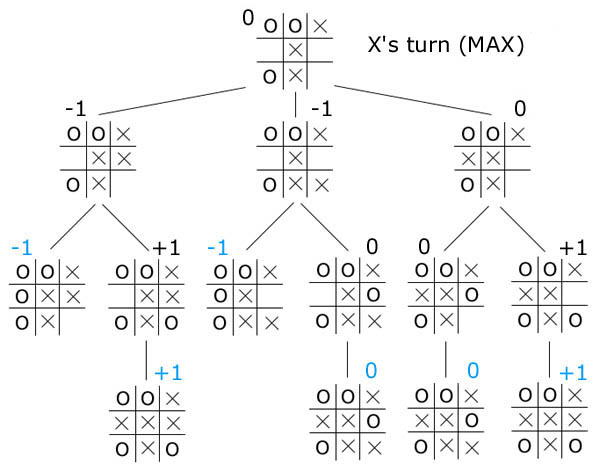
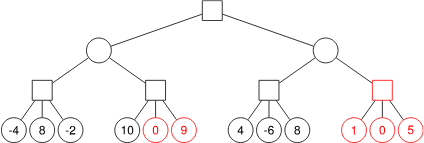

# Semana 13: Ramificación y poda y árboles de juego

##Objetivos:

>- Conocer el método algorítmico de ramificación y poda y saber aplicarlo en la resolución de problemas.

>- Saber aplicar ramificación y poda en los problemas de la mochila entera y de planificación de tareas con plazo fijo, duración y coste.

>- Conocer los árboles de juego y cómo se utilizan para decidir la siguiente jugada a realizar en un juego.

>- Conocer el algoritmo minimax y la poda alfa-beta.

## 13.1 Ramificación y poda

El método de ramificación y poda se utiliza habitualmente para resolver problemas de optimización en los que las técnicas algorítmicas divide y vencerás, método voraz o programación dinámica no pueden aplicarse, y es necesario buscar de forma exhaustiva en todo el espacio de posibles soluciones hasta dar con la mejor de ellas. Puesto que habitualmente el tamaño del espacio de soluciones es muy grande es importante estructurarlo de forma que sea posible descartar soluciones parciales no factibles cuanto antes. Tanto en el esquema algorítmico de vuelta atrás, visto en el curso anterior, como en el de ramificación y poda se construyen las soluciones por etapas y un test de factibilidad aplicado en cada etapa permite evitar la exploración de aquellas partes del espacio de soluciones que no conducirán a soluciones que cumplan las restricciones del problema. En ambos se utilizan también marcadores que permiten comprobar de forma más eficiente la factibilidad de la solución parcial a costa de utilizar memoria adicional.

La diferencia entre las dos técnicas algorítmicas es la forma en la que se explora el espacio de soluciones: en vuelta atrás se explora en profundidad mediante el uso de la recursión, mientras que en ramificación y poda se utiliza una cola de prioridad para determinar cuál es el siguiente nodo a explorar. La prioridad de los nodos del espacio de soluciones es una estimación del valor de la mejor solución alcanzable desde cada nodo por lo que permite determinar cuál es el que parece más prometedor, es decir, el que tiene más posibilidades de conducirnos a la mejor solución. 

En el siguiente vídeo se recuerda el método de vuelta atrás y se introduce el método algorítmico de ramificación y poda.

[Ramificación y poda URL (15:37)](https://www.youtube.com/watch?v=3tjypEcUUBE)

## 13.2 Tareas con plazo fijo, duración y coste

Como ya vimos anteriormente, el problema de planificación de tareas con plazo fijo y coste en el que todas las tareas tienen la misma duración se puede resolver mediante una estrategia voraz eficiente. Dicha estrategia no puede aplicarse cuando las tareas tienen duraciones distintas. 

En el siguiente vídeo se explica cómo resolver esta nueva versión del problema utilizando ramificación y poda. Para cada tarea se consideran las dos posibles opciones: incluirla o no en la planificación. El test de factibilidad es similar al utilizado en el algoritmo voraz.

[Tareas con plazo fijo, duración y coste URL (10:15)](https://www.youtube.com/watch?v=QXhBrctw6ao&feature=youtu.be)

13.3 Problema de la mochila entera
Ya vimos que el problema de la mochila entera en el que los pesos son números enteros puede resolverse utilizando programación dinámica. Sin embargo, si los pesos son números reales no podemos aplicarla.
En el siguiente vídeo se explica cómo resolver esta nueva versión del problema utilizando ramificación y poda. Para cada objeto se consideran las dos posibles opciones: incluirlo o no en la mochila. El algoritmo voraz utilizado en la versión del problema en la que los objetos se pueden partir se puede usar para estimar el valor de la mejor solución alcanzable a partir de una solución parcial y por tanto para establecer la prioridad de los nodos.

[Problema de la mochila entera (ramificación y poda) URL (8:30)](https://www.youtube.com/watch?v=LnUpA979NNA&feature=youtu.be)

>- En el problema 57  Funcionarios del Ministerio del juez automático se desea establecer una biyección entre  un conjunto de $n$ trabajos y un grupo de $n$ funcionarios de forma que la suma de los tiempos invertidos en la realización de los mismos sea mínima. Todos los funcionarios son capaces de hacer cualquiera de los trabajos aunque tardan distinto tiempo, información que viene dada por una matriz de tiempos. Piensa en distintas formas de asignar la prioridad a los nodos de la cola de prioridad y compáralas entre sí.

>- En el problema  58  Quitanieves en Invernalia del juez automático se dispone de máquinas quitanieves de diferentes anchuras que se pueden mandar a limpiar carreteras, también de distintas anchuras, con una determinada calidad de limpieza que viene dada en una matriz. Se desea maximizar la suma de las calidades obtenidas teniendo en cuenta que a cada carretera a lo sumo se manda una máquina, cada máquina a lo sumo puede limpiar una carretera y que la máquina debe caber de ancho en la carretera. Piensa en distintas formas de representar la solución y en distintas formas de asignar la prioridad a los nodos de la cola de prioridad y compáralas entre sí.

## 13.4 Árboles de juego

A la hora de construir un programa que juegue a un juego es necesario representar los distintos estados o configuraciones por los que va pasando a medida que los jugadores realizan sus jugadas.  Vamos a considerar juegos de dos jugadores en los que no hay elementos de azar como tener que lanzar un dado; que son observables, es decir, que todos los jugadores conocen los mismos elementos del estado del juego en cada momento y que son de suma nula, es decir que lo que es bueno para un jugador perjudica al contrario y viceversa. En algunos juegos de este tipo, como el juego del Nim es posible tomar decisiones iniciales que aseguren la victoria del jugador inicial si toma las decisiones adecuadas, o el empate como es el caso de las Tres en Raya.
Los árboles de juego permiten representar todos los posibles estados alcanzables desde el estado inicial de un juego en el que uno de los jugadores comienza, es decir todas las posibles partidas.  Mediante una función de valoración de cada uno de los estados finales del juego podemos determinar qué jugada realizar a continuación.  En la siguiente imagen se muestra un árbol de juego para las tres en raya en el que le toca jugar al jugador X. En dicho árbol se valora con +1 las configuraciones finales en las que X gana, con 0 aquellas en las que ningún jugador gana y con -1 aquellas en las que pierde.

El algoritmo que propaga la valoración desde los estados finales hasta el inicial recibe el nombre de minimax, porque alterna el cálculo del máximo en aquellos nodos en los que el turno lo tiene el jugador inicial con el del mínimo en los nodos en los que el turno lo tiene el jugador contrario. El funcionamiento del algoritmo se basa en considerar que cada jugador va a tomar las mejores decisiones para sí mismo y como consecuencia esas serán las que más perjudican al contrario. En juegos complejos, como el ajedrez, es imposible evaluar el árbol de todas las posibles partidas debido a su enorme tamaño, por lo que solamente se evalúa hasta una determinada profundidad. La poda alfa-beta es una técnica que permite evitar la evaluación de algunas partes del árbol de juego que no contribuyen a la hora de tomar la mejor decisión, de forma que el tiempo ahorrado puede dedicarse a profundizar más en el árbol de juego con la consiguiente mejora en las decisiones tomadas.

En el siguiente vídeo se explica el algoritmo de minimax y la poda alfa-beta.

[Árboles de juego URL (24:15)](https://www.youtube.com/watch?v=6GsUsLg2r5k)

En [esta página](https://www.yosenspace.com/posts/computer-science-game-trees.html) puedes comprobar con ejemplos interactivos el funcionamiento de minimax y de la poda alfa-beta.
En el entorno de cuestionarios, puedes encontrar el cuestionario de autoevaluación del material de esta semana.

Material adicional. Diapositivas 33 a 36
[Ramificación y poda](./PDFs/33%20Ramificación%20y%20poda.pdf)

[Tareas con plazo fijo, duración y coste](./PDFs/34%20Tareas%20con%20plazo%20fijo,%20duración%20y%20coste.pdf)

[Problema de la mochila entera (ramificación y poda)](./PDFs/35%20Problema%20de%20la%20mochila%20entera%20(RP).pdf)

[Árboles de juego](./PDFs/36%20Árboles%20de%20juego.pdf))

## Cuestionario semana 13

1. ¿Qué jugada ha de elegir el jugador actual según este árbol y qué valor obtiene con ella?

>La primera jugada con un valor obtenido de 8. El algoritmo minimax calcula desde las hojas hacia la raíz alternando mínimos y máximos. Los valores de los nodos con forma de cuadrado del penúltimo nivel en el dibujo se calculan haciendo el máximo de los valores de sus hijos. De izquierda a derecha esos valores son 8, 10, 8 y 6.
>A continuación se calcula el valor de los nodos con forma de círculo haciendo el mínimo de sus hijos, siendo estos valores de izquierda a derecha 8 y 6.
>Finalmente, el valor de la raíz es el máximo de estos dos valores. Como 8 > 6, la respuesta correcta es que el jugador debería elegir la primera jugada y obtener valor 8.
>Hay otras ramas del árbol de juego que conducen a valores mayores como la que conduce al valor 10, pero si el jugador contrario juega de manera óptima nuestro jugador no tiene opciones de alcanzarla. Si nuestro jugador eligiese la segunda jugada y el jugador contrario jugase de manera óptima como máximo conseguiría el valor 6, aunque si el contrario eligiese mal podría alcanzar igualmente el valor 8.

2. ¿Cuál de los siguientes juegos se pueden abordar con el algoritmo minimax visto en clase?

> El algoritmo minimax se aplica a juegos con información perfecta (en los que se conoce el estado del juego) donde el jugador y el adversario puede tomar decisiones. Eso excluye juegos de azar puro y solitarios.

- :heavy_check_mark: Damas, cumple todas las condiciones.
- :x: Piedra, papel y tijeras, no es un juego por turnos (las acciones de los jugadores son simultáneas).
- :x: Bingo, es un juego de azar puro.
- :heavy_check_mark: 3 en ralla, cumple todas las condiciones.

3. Al finalizar su ejecución de ramificación y poda la cola de prioridad:

>El algoritmo de ramificación y poda puede detenerse o bien porque la cola de prioridad queda vacía o bien porque la prioridad del más prioritario de la cola es peor (menor o mayor dependiendo de si es un problema de maximización o minimización) que el valor de la mejor solución encontrada hasta el momento. Por tanto, no siempre queda vacía y en caso de que no lo esté, todos los nodos que permanecen en ella son no prometedores. Por otra parte, en la cola de prioridad nunca entran nodos no factibles. Así que la respuesta correcta es que solo puede contener nodos no prometedores.

4. En el algoritmo de la mochila resuelto con ramificación y poda, la prioridad de los nodos que son hijos derechos (aquellos en los que se decide no meter el objeto correspondiente en la mochila) coincide con la de sus padres.

> Falso. La prioridad de una solución parcial en este problema se obtiene aplicando el algoritmo voraz a los objetos aún no considerados con el peso límite disponible en ese momento. Supongamos objetos con valores ${5, 15, 20}$ y ${1, 5, 10}$ y peso límite $4$, que ya están ordenados de mayor a menor valor por unidad de peso para poder aplicar la estrategia voraz. La prioridad del nodo raíz es $14$, mientras que la de su hijo derecho es $12$.

5. En un problema de minimización resuelto mediante ramificación y poda la estuamciñon utilizada para asignar prioridad a los nodos:

>Debe ser una cota inferior de la mejor solución alanzable desde este nodo. En un problema de minimización la estimación utilizada para asignar prioridad a los nodos ha de ser una cota inferior, no superior, de la mejor solución alcanzable desde ese nodo. De esta forma si la estimación de un nodo es superior al valor de la mejor encontrada hasta el momento eso quiere decir que ninguna solución alcanzada desde ese nodo puede mejorarla y no interesa por tanto expandir dicho nodo. El valor de la solución parcial no tiene por qué ser siempre cota inferior de la mejor solución alcanzable, por lo que esta opción no es correcta. Si se trata de una solución completa, en general tampoco su valor tiene por qué coincidir con la estimación, aunque es bastante habitual.

6. La técnica de ramificación y poda tealiza un recorrido de la parte no podad del espacio de soluciones.
> Falso. En este esquema se utiliza una cola de prioridad que permite recorrer el espacio de soluciones explorando primero aquellas soluciones parciales que se estima son más prometedoras desde el punto de vista de una función a optimizar. El recorrido por tanto no sigue ningún patrón fijo como el del recorrido en profundidad o en anchura, aunque podrían conseguirse dichos recorridos asignando las prioridades adecuadas a las soluciones parciales.

7. El algoritmo de ramificación y poda que resuelve la versión entera del problema de la mochila puede utilizar el algoritmo voraz usando en la versión que los objetos pueden partirse apra asignar la prioridad a los nodos de la cola.

> Verdadero. En un problema de maximización la estimación utilizada para asignar prioridad a los nodos ha de ser una cota superior de la mejor solución alcanzable desde ese nodo. Puesto que el valor devuelto por la estrategia voraz es una cota superior de cualquier solución que respete la restricción de peso límite del problema, al aplicarla a partir de una solución parcial obtenemos una cota superior de todas las soluciones alcanzables a partir de ella.

8. Según este árbol de juego, si el jugador inicial realiza la segunda jugada es imposible que pueda alcanzar una configuración del juego de valor 7.

>Falso. Se puede alcanzar ese valor si el contrario no juega de manera óptima.
>- Si el algoritmo minimax calcula desde las hojas hacia la raíz alternando mínimos y máximos. Los valores de los nodos con forma de cuadrado del penúltimo nivel en el dibujo se calculan haciendo el máximo de los valores de sis hijos. De izquierda a derecha esos valores son $7,9,7$ y $4$.
>- A continuación se calcula el valor de los nodos con forma de círculo haciendo el mínimo de sus hijos, siendo estos valores de izquierda a derecha $7$ y $4$.
>- Finalmente, el valor de la raíz es el máximo de estos dos valores. Como $7> 4$, el jugador debería elegir la primera jugada y obtener valor $7$.
>- Si el jugador eligiese la segunda jugada y el contrario jugase de manera óptima podría obtener como máximo el valor del hijo derecho, es decir $4$. Pero si el contrario eligiese, erróneamente, su primera jugada sí podría alcanzar a continuación el valor $7$ eligiendo la tercera jugada.

9. Resolver una versión del problema con más restricciones siempre es una forma correcta de calcular la estimación utilizada para dar prioridad a los nodos y podar los no prometedores en la técnica algorítmica de ramificación y poda.

> Falso. Cualquier solución óptima a un problema con menos restricciones es tan buena o mejor que una solución del problema original (naturalmente, porque las soluciones del problema original son soluciones del modificado), luego sirve como estimación en la ramificación y poda. En cambio, si añadimos más restricciones al problema, estas podrían excluir la solución óptima del original, dando una estimación pesimista que podaría soluciones óptimas.

10. Si utilizamos la poda alfa-beta en este árbol de juego, ¿cuántos nodos se podan?

> Los nodos podados se muestran en rojo:

Veamos lo que sucede en cada uno de los cuatro subárboles con raíz cuadrad del epnultimo nivel.
En el primer subárbol inicialmente $\alpha = - \infty$ y $\beta=+\infty$ y mientras se calcula el máximo de los hijos $\alpha$ va cambiando de valor a $-4$ y luego $8$. No se produce ninguna poda y cuando termina
